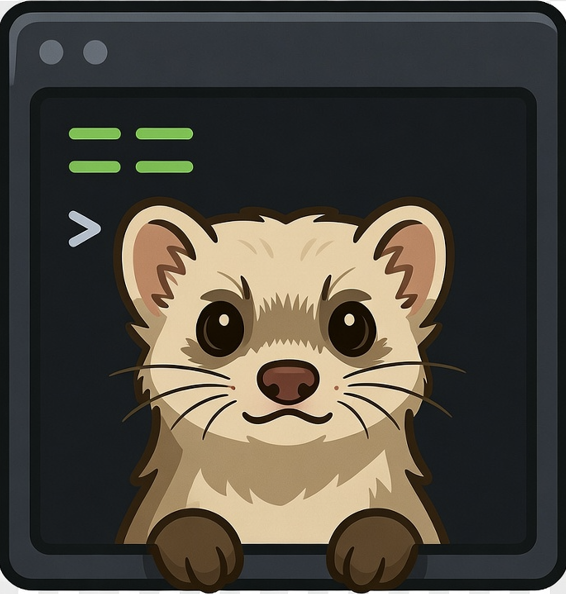

<div align="center">
  

  # DevMaid

  Uma poderosa ferramenta CLI .NET para automatizar tarefas comuns de desenvolvimento.
</div>

## Descrição

DevMaid é uma interface de linha de comando (CLI) multiplataforma construída com .NET que ajuda desenvolvedores a automatizar tarefas repetitivas de desenvolvimento. Ela fornece comandos para operações de banco de dados, gerenciamento de arquivos, instalação de ferramentas de IA (Claude Code, OpenCode) e gerenciamento de pacotes Windows.

> **Nota**: Este é um projeto hobby criado para uso pessoal. Pode não seguir todas as melhores práticas ou ter testes abrangentes. Contribuições e feedback são bem-vindos, mas por favor tenha em mente que isso foi criado para resolver as necessidades específicas do autor.

## Problema que Resolve

Desenvolvedores frequentemente executam tarefas repetitivas que podem ser automatizadas:
- Combinar múltiplos arquivos em um só
- Instalar e configurar ferramentas de IA para desenvolvimento
- Fazer backup e restaurar pacotes do Windows

DevMaid consolida essas tarefas em uma única ferramenta CLI fácil de usar.

## Principais Funcionalidades

- **Database Backup**: Faz backup de bancos de dados PostgreSQL usando pg_dump
- **File (Combine)**: Combina múltiplos arquivos em um único
- **Integração com Claude Code**: Instala e configura CLI do Claude Code
- **Integração com OpenCode**: Instala e configura CLI do OpenCode
- **Gerenciador Winget**: Faz backup e restaura pacotes do gerenciador de pacotes Windows

## Tecnologias

- **Framework**: .NET 10
- **Linguagem**: C#
- **CLI Parsing**: System.CommandLine
- **Banco de Dados**: Npgsql (PostgreSQL)
- **Configuração**: Microsoft.Extensions.Configuration

## Instalação

### Pré-requisitos

- .NET SDK 10 ou superior
- Windows (necessário para comandos Claude, OpenCode e Winget)

### Instalar como Ferramenta .NET

```bash
dotnet tool install --global DevMaid
```

Ou instalar pelo NuGet:

```bash
dotnet tool install -g DevMaid
```

### Compilar a Partir do Código Fonte

```bash
git clone https://github.com/seu-repositorio/DevMaid.git
cd DevMaid
dotnet restore
dotnet build
```

## Como Executar Localmente

### Executar a Partir do Código Fonte

```bash
dotnet run -- --help
```

## Exemplos de Uso Básico

### Database Backup

```bash
# Backup com configurações de conexão padrão (do appsettings.json)
devmaid database backup meubanco

# Backup com configurações de conexão personalizadas
devmaid database backup meubanco --host localhost --port 5432 --username postgres --password minhasenha

# Backup com caminho de saída personalizado
devmaid database backup meubanco -o "C:\backups\meubanco.backup"

# Backup com prompt de senha (senha não fornecida na linha de comando)
devmaid database backup meubanco --host localhost --username postgres
```

**Arquivo de Configuração**: Crie um `appsettings.json` em `%LocalAppData%\DevMaid\` para definir valores de conexão padrão:

```json
{
  "Database": {
    "Host": "localhost",
    "Port": "5432",
    "Username": "postgres",
    "Password": ""
  }
}
```


```bash
```

### Combinar Arquivos

```bash
devmaid file combine -i "C:\temp\*.sql" -o "C:\temp\resultado.sql"
```

### Instalar Claude Code

```bash
devmaid claude install
```

### Backup Winget

```bash
devmaid winget backup -o "C:\backup"
```

### Restaurar Winget

```bash
devmaid winget restore -i "C:\backup\backup-winget.json"
```

## Lista de Comandos

| Comando | Descrição |
|---------|-----------|
| `database backup` | Faz backup de banco de dados PostgreSQL |
| `file combine` | Combina múltiplos arquivos em um único |
| `claude` | Integração com Claude Code |
| `opencode` | Integração com CLI do OpenCode |
| `winget` | Gerenciador de pacotes Windows |

## Documentação

Para informações mais detalhadas, consulte:

- [Arquitetura](./docs/pt-BR/ARCHITECTURE.md)
- [Especificação de Funcionalidades](./docs/pt-BR/FEATURE_SPECIFICATION.md)

## Contribuição

Contribuições são bem-vindas! Por favor, siga estes passos:

1. Fork o repositório
2. Crie uma branch de funcionalidade (`git checkout -b feature/nova-funcionalidade`)
3. Commit suas mudanças (`git commit -m 'Adiciona nova funcionalidade'`)
4. Push para a branch (`git push origin feature/nova-funcionalidade`)
5. Abra um Pull Request

Por favor, certifique-se de que todos os testes passam e que o código segue os padrões de codificação do projeto.

## Licença

Este projeto está licenciado sob a Licença MIT - veja o arquivo [LICENSE](./LICENSE) para detalhes.

---

🇺🇸 English: [README.md](./README.md)  
🇧🇷 Português (padrão)
