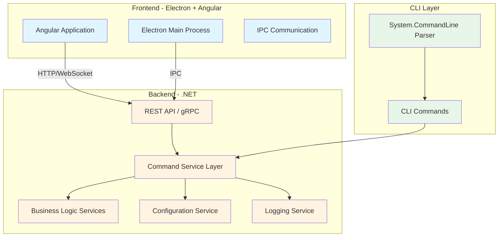

# GUI Refactoring Plan (Electron + Angular)

## Overview

This document describes the refactoring plan for DevMaid to include a modern graphical user interface (GUI) built with Electron and Angular, while maintaining the existing CLI functionality.

## 1. Current Architecture Analysis

### 1.1 Current Structure
```
DevMaid/
├── Program.cs                 # CLI Entry point
├── Commands/                  # Command implementations
├── CommandOptions/            # DTOs for command options
├── Services/                  # Business logic services
├── Tui/                       # Terminal Interface (Terminal.Gui)
└── Utils.cs                   # Helper functions
```

### 1.2 Current Issues
- **Tight coupling**: Business logic is directly coupled to System.CommandLine
- **No API layer**: No REST or gRPC API for external communication
- **Console-bound logger**: Logger writes directly to console
- **Synchronous execution**: Processes are executed synchronously

### 1.3 Current Strengths
- Clear separation between Commands and Services
- Use of DTOs for command options
- Centralized configuration via ConfigurationService
- Good test structure

## 2. Proposed Architecture

### 2.1 Architecture Diagram



### 2.2 New Project Structure

```
DevMaid/
├── DevMaid.Core/                    # Core Business Logic
│   ├── Services/
│   ├── Models/
│   ├── Interfaces/
│   └── DevMaid.Core.csproj
│
├── DevMaid.CLI/                     # CLI Application
│   ├── Program.cs
│   ├── Commands/
│   ├── CommandOptions/
│   └── DevMaid.CLI.csproj
│
├── DevMaid.Api/                     # REST API / gRPC Service
│   ├── Controllers/
│   ├── Services/
│   ├── Middleware/
│   ├── DevMaid.Api.csproj
│   └── appsettings.json
│
├── DevMaid.Gui/                     # Electron + Angular Application
│   ├── angular-app/                 # Angular frontend
│   │   ├── src/
│   │   │   ├── app/
│   │   │   │   ├── components/
│   │   │   │   ├── services/
│   │   │   │   ├── models/
│   │   │   │   └── modules/
│   │   │   ├── assets/
│   │   │   └── environments/
│   │   ├── angular.json
│   │   ├── package.json
│   │   └── tsconfig.json
│   ├── electron/                    # Electron main process
│   │   ├── main.ts
│   │   ├── preload.ts
│   │   └── package.json
│   ├── package.json
│   └── README.md
│
├── DevMaid.Tests/                   # Tests
│   ├── Core.Tests/
│   ├── CLI.Tests/
│   ├── API.Tests/
│   └── DevMaid.Tests.csproj
│
├── docs/                            # Documentation
│   └── ...
└── DevMaid.slnx                     # Solution file
```

## 3. Refactoring Strategy

### 3.1 Phase 1: Core Layer Extraction (MVP)

**Objective**: Separate business logic from CLI

**Tasks**:
1. Create `DevMaid.Core` project
2. Extract Services from current project to `DevMaid.Core`
3. Create interfaces for all services
4. Implement abstract logging service (ILogger already exists)
5. Move DTOs to `DevMaid.Core.Models`
6. Create standardized response models

**New Core Services**:
```csharp
// DevMaid.Core/Services/IDatabaseService.cs
public interface IDatabaseService
{
    Task<DatabaseBackupResult> BackupAsync(DatabaseBackupOptions options, IProgress<OperationProgress>? progress = null);
    Task<DatabaseRestoreResult> RestoreAsync(DatabaseRestoreOptions options, IProgress<OperationProgress>? progress = null);
    Task<List<string>> ListDatabasesAsync(DatabaseConnectionOptions options);
}

// DevMaid.Core/Services/IFileService.cs
public interface IFileService
{
    Task<FileCombineResult> CombineFilesAsync(FileCombineOptions options, IProgress<OperationProgress>? progress = null);
}

// DevMaid.Core/Services/IWingetService.cs
public interface IWingetService
{
    Task<WingetBackupResult> BackupPackagesAsync(WingetBackupOptions options, IProgress<OperationProgress>? progress = null);
    Task<WingetRestoreResult> RestorePackagesAsync(WingetRestoreOptions options, IProgress<OperationProgress>? progress = null);
}
```

**Response Models**:
```csharp
// DevMaid.Core/Models/OperationResult.cs
public record OperationResult
{
    public bool Success { get; init; }
    public string? Message { get; init; }
    public string? ErrorMessage { get; init; }
    public Exception? Exception { get; init; }
    public TimeSpan Duration { get; init; }
}

public record OperationProgress
{
    public int CurrentStep { get; init; }
    public int TotalSteps { get; init; }
    public string? CurrentOperation { get; init; }
    public double Percentage { get; init; }
}
```

### 3.2 Phase 2: CLI Refactoring

**Objective**: Adapt CLI to use Core layer

**Tasks**:
1. Create `DevMaid.CLI` project
2. Move Commands and CommandOptions to `DevMaid.CLI`
3. Adapt Commands to use Core services
4. Maintain compatibility with existing commands
5. Add visual progress support in CLI

**Example of adaptation**:
```csharp
// DevMaid.CLI/Commands/DatabaseCommand.cs
public static class DatabaseCommand
{
    public static Command Build()
    {
        var command = new Command("database", "Database utilities.");
        var databaseService = new DatabaseService(ConfigurationService.GetDatabaseConfig(), Logger.Instance);
        
        command.AddCommand(BuildBackupCommand(databaseService));
        command.AddCommand(BuildRestoreCommand(databaseService));
        
        return command;
    }
    
    private static Command BuildBackupCommand(IDatabaseService databaseService)
    {
        var backupCommand = new Command("backup", "Create a backup of a PostgreSQL database.");
        
        // ... options setup ...
        
        backupCommand.SetAction(async parseResult =>
        {
            var options = ParseOptions(parseResult);
            var progress = new ConsoleProgressReporter();
            
            try
            {
                var result = await databaseService.BackupAsync(options, progress);
                
                if (result.Success)
                {
                    Logger.LogInformation($"Backup completed successfully in {result.Duration.TotalSeconds:F2}s");
                }
                else
                {
                    Logger.LogError($"Backup failed: {result.ErrorMessage}");
                }
            }
            catch (Exception ex)
            {
                Logger.LogError($"Error: {ex.Message}");
            }
        });
        
        return backupCommand;
    }
}
```

### 3.3 Phase 3: API Backend Creation

**Objective**: Create REST API for GUI communication

**Tasks**:
1. Create `DevMaid.Api` project (ASP.NET Core Web API)
2. Implement controllers for each service
3. Add SignalR support for real-time updates
4. Implement authentication/authorization (if needed)
5. Add CORS for Electron communication
6. Create OpenAPI/Swagger documentation

**Example Controller**:
```csharp
// DevMaid.Api/Controllers/DatabaseController.cs
[ApiController]
[Route("api/[controller]")]
public class DatabaseController : ControllerBase
{
    private readonly IDatabaseService _databaseService;
    private readonly IHubContext<OperationHub> _hubContext;
    
    public DatabaseController(IDatabaseService databaseService, IHubContext<OperationHub> hubContext)
    {
        _databaseService = databaseService;
        _hubContext = hubContext;
    }
    
    [HttpPost("backup")]
    public async Task<ActionResult<DatabaseBackupResult>> Backup([FromBody] DatabaseBackupOptions options)
    {
        var progress = new SignalRProgressReporter(_hubContext, Context.ConnectionId);
        var result = await _databaseService.BackupAsync(options, progress);
        
        if (result.Success)
            return Ok(result);
        else
            return BadRequest(result);
    }
    
    [HttpPost("restore")]
    public async Task<ActionResult<DatabaseRestoreResult>> Restore([FromBody] DatabaseRestoreOptions options)
    {
        var progress = new SignalRProgressReporter(_hubContext, Context.ConnectionId);
        var result = await _databaseService.RestoreAsync(options, progress);
        
        if (result.Success)
            return Ok(result);
        else
            return BadRequest(result);
    }
    
    [HttpGet("databases")]
    public async Task<ActionResult<List<string>>> ListDatabases([FromQuery] DatabaseConnectionOptions options)
    {
        var databases = await _databaseService.ListDatabasesAsync(options);
        return Ok(databases);
    }
}
```

**SignalR Hub for progress**:
```csharp
// DevMaid.Api/Hubs/OperationHub.cs
public class OperationHub : Hub
{
    public async Task JoinOperationGroup(string operationId)
    {
        await Groups.AddToGroupAsync(Context.ConnectionId, operationId);
    }
    
    public async Task LeaveOperationGroup(string operationId)
    {
        await Groups.RemoveFromGroupAsync(Context.ConnectionId, operationId);
    }
}
```

### 3.4 Phase 4: Angular Frontend Development

**Objective**: Create modern and responsive interface

**Technologies**:
- Angular 18+ (latest)
- Angular Material 18+
- RxJS for reactive streams
- HttpClient for API communication
- SignalR Client for real-time updates

**Angular Structure**:
```
angular-app/src/app/
├── core/
│   ├── services/
│   │   ├── api.service.ts
│   │   ├── signalr.service.ts
│   │   └── configuration.service.ts
│   └── models/
│
├── shared/
│   ├── components/
│   │   ├── progress-dialog/
│   │   ├── error-dialog/
│   │   └── confirmation-dialog/
│   └── pipes/
│
├── features/
│   ├── database/
│   │   ├── components/
│   │   │   ├── database-backup.component.ts
│   │   │   ├── database-restore.component.ts
│   │   │   └── database-list.component.ts
│   │   ├── services/
│   │   └── models/
│   ├── files/
│   │   ├── components/
│   │   │   └── file-combine.component.ts
│   │   └── services/
│   ├── winget/
│   │   ├── components/
│   │   │   ├── winget-backup.component.ts
│   │   │   └── winget-restore.component.ts
│   │   └── services/
│   └── claude/
│       ├── components/
│       └── services/
│
├── layout/
│   ├── components/
│   │   ├── sidebar/
│   │   ├── header/
│   │   └── main-content/
│   └── services/
│
└── app-routing.module.ts
```

**Example Angular Service**:
```typescript
// angular-app/src/app/features/database/services/database.service.ts
@Injectable({ providedIn: 'root' })
export class DatabaseService {
  private readonly apiUrl = 'api/database';
  
  constructor(
    private http: HttpClient,
    private signalRService: SignalRService
  ) {}
  
  backup(options: DatabaseBackupOptions): Observable<DatabaseBackupResult> {
    return this.http.post<DatabaseBackupResult>(
      `${this.apiUrl}/backup`,
      options
    );
  }
  
  backupWithProgress(options: DatabaseBackupOptions): Observable<OperationProgress> {
    return this.signalRService.subscribeToProgress();
  }
  
  restore(options: DatabaseRestoreOptions): Observable<DatabaseRestoreResult> {
    return this.http.post<DatabaseRestoreResult>(
      `${this.apiUrl}/restore`,
      options
    );
  }
  
  listDatabases(connection: DatabaseConnectionOptions): Observable<string[]> {
    return this.http.get<string[]>(`${this.apiUrl}/databases`, {
      params: this.httpParamsFrom(connection)
    });
  }
}
```

**Example Component**:
```typescript
// angular-app/src/app/features/database/components/database-backup.component.ts
@Component({
  selector: 'dm-database-backup',
  templateUrl: './database-backup.component.html',
  styleUrls: ['./database-backup.component.scss']
})
export class DatabaseBackupComponent implements OnInit {
  form = this.fb.group({
    databaseName: ['', Validators.required],
    host: ['localhost'],
    port: ['5432'],
    username: [''],
    password: [''],
    outputPath: [''],
    backupAll: [false],
    excludeTableData: this.fb.array([])
  });
  
  isBackingUp = false;
  progress: OperationProgress | null = null;
  
  constructor(
    private fb: FormBuilder,
    private databaseService: DatabaseService,
    private snackBar: MatSnackBar
  ) {}
  
  ngOnInit(): void {
    this.loadSavedConfiguration();
  }
  
  async onBackup(): Promise<void> {
    if (this.form.invalid) return;
    
    this.isBackingUp = true;
    const options = this.form.value;
    
    try {
      // Subscribe to progress updates
      const progress$ = this.databaseService.backupWithProgress(options);
      progress$.subscribe(progress => {
        this.progress = progress;
      });
      
      // Execute backup
      const result = await firstValueFrom(this.databaseService.backup(options));
      
      if (result.success) {
        this.snackBar.open('Backup completed successfully!', 'Close', {
          duration: 3000
        });
      } else {
        this.snackBar.open(`Backup failed: ${result.errorMessage}`, 'Close', {
          duration: 5000
        });
      }
    } catch (error) {
      this.snackBar.open('An error occurred during backup', 'Close', {
        duration: 5000
      });
    } finally {
      this.isBackingUp = false;
      this.progress = null;
    }
  }
}
```

### 3.5 Phase 5: Electron Integration

**Objective**: Package application as desktop app

**Tasks**:
1. Configure Electron main process
2. Implement preload script for IPC
3. Configure auto-updater
4. Create installer (NSIS or squirrel)
5. Configure build for multiple platforms

**Example Main Process**:
```typescript
// electron/main.ts
import { app, BrowserWindow, ipcMain } from 'electron';
import * as path from 'path';

let mainWindow: BrowserWindow;

function createWindow(): void {
  mainWindow = new BrowserWindow({
    width: 1200,
    height: 800,
    webPreferences: {
      preload: path.join(__dirname, 'preload.js'),
      nodeIntegration: false,
      contextIsolation: true
    },
    icon: path.join(__dirname, '../assets/icon.png')
  });

  // Load Angular app
  if (process.env.NODE_ENV === 'development') {
    mainWindow.loadURL('http://localhost:4200');
    mainWindow.webContents.openDevTools();
  } else {
    mainWindow.loadFile(path.join(__dirname, '../angular-app/index.html'));
  }
}

app.whenReady().then(() => {
  createWindow();
  
  app.on('activate', () => {
    if (BrowserWindow.getAllWindows().length === 0) {
      createWindow();
    }
  });
});

app.on('window-all-closed', () => {
  if (process.platform !== 'darwin') {
    app.quit();
  }
});

// IPC handlers
ipcMain.handle('get-app-version', () => {
  return app.getVersion();
});

ipcMain.handle('minimize-window', () => {
  mainWindow.minimize();
});

ipcMain.handle('maximize-window', () => {
  if (mainWindow.isMaximized()) {
    mainWindow.unmaximize();
  } else {
    mainWindow.maximize();
  }
});

ipcMain.handle('close-window', () => {
  mainWindow.close();
});
```

**Example Preload Script**:
```typescript
// electron/preload.ts
import { contextBridge, ipcRenderer } from 'electron';

contextBridge.exposeInMainWorld('electronAPI', {
  getAppVersion: () => ipcRenderer.invoke('get-app-version'),
  minimizeWindow: () => ipcRenderer.invoke('minimize-window'),
  maximizeWindow: () => ipcRenderer.invoke('maximize-window'),
  closeWindow: () => ipcRenderer.invoke('close-window'),
  on: (channel: string, callback: (...args: any[]) => void) => {
    ipcRenderer.on(channel, (event, ...args) => callback(...args));
  }
});
```

**Build Configuration**:
```json
{
  "name": "devmaid-gui",
  "version": "1.0.0",
  "main": "dist/electron/main.js",
  "scripts": {
    "build:angular": "cd angular-app && ng build --configuration production",
    "build:electron": "tsc electron/main.ts electron/preload.ts",
    "build": "npm run build:angular && npm run build:electron",
    "electron": "electron .",
    "electron:dev": "concurrently \"npm run build:angular -- --watch\" \"wait-on http://localhost:4200 && electron .\"",
    "pack": "electron-builder --dir",
    "dist": "electron-builder"
  },
  "build": {
    "appId": "com.devmaid.gui",
    "productName": "DevMaid",
    "directories": {
      "output": "dist/electron-builder"
    },
    "files": [
      "dist/electron/**/*",
      "angular-app/dist/**/*",
      "assets/**/*"
    ],
    "win": {
      "target": ["nsis"],
      "icon": "assets/icon.ico"
    },
    "mac": {
      "target": ["dmg"],
      "icon": "assets/icon.icns"
    },
    "linux": {
      "target": ["AppImage", "deb"],
      "icon": "assets/icon.png"
    }
  },
  "devDependencies": {
    "@types/node": "^20.0.0",
    "electron": "^28.0.0",
    "electron-builder": "^24.0.0",
    "typescript": "^5.0.0"
  }
}
```

### 3.6 Phase 6: Hybrid Mode (CLI + GUI)

**Objective**: Allow user to choose between CLI and GUI

**Tasks**:
1. Modify `Program.cs` to detect if GUI should start
2. Add `devmaid gui` command to launch graphical interface
3. Configure API to run in background when GUI is active
4. Implement single instance to avoid multiple instances

**Example Updated Program.cs**:
```csharp
// Program.cs
internal static class Program
{
    private static int Main(string[] args)
    {
        // Check if GUI mode is requested
        if (args.Length > 0 && args[0].Equals("gui", StringComparison.OrdinalIgnoreCase))
        {
            return RunGuiMode(args.Skip(1).ToArray());
        }
        
        // CLI mode
        return RunCliMode(args);
    }
    
    private static int RunGuiMode(string[] args)
    {
        // Start API server in background
        var apiTask = Task.Run(() => DevMaid.Api.Program.Main(args));
        
        // Launch Electron GUI
        var electronPath = Path.Combine(AppContext.BaseDirectory, "DevMaid.Gui.exe");
        var process = Process.Start(electronPath);
        
        // Wait for API to complete (usually never)
        apiTask.Wait();
        
        return 0;
    }
    
    private static int RunCliMode(string[] args)
    {
        // Existing CLI logic
        Logger.SetLogger(new ConsoleLogger(useColors: true));
        
        var rootCommand = new RootCommand("DevMaid command line tools")
        {
            FileCommand.Build(),
            // ... other commands ...
            new Command("gui", "Launch graphical user interface")
        };
        
        return rootCommand.Parse(args).Invoke();
    }
}
```

## 4. Technical Considerations

### 4.1 Frontend-Backend Communication

**Option 1: REST API + SignalR (Recommended)**
- Pros: Easy to implement, good Angular support
- Cons: Requires HTTP server

**Option 2: gRPC**
- Pros: More efficient, type-safe
- Cons: More complex, requires gRPC-Web for browser

**Option 3: Electron Native IPC**
- Pros: Direct communication, no HTTP server
- Cons: Requires .NET IPC wrapper, more complex

**Recommendation**: Use REST API + SignalR initially, consider gRPC for future optimizations.

### 4.2 Process Management

**Challenge**: Execute long processes (pg_dump, winget) with real-time feedback

**Solution**:
```csharp
// DevMaid.Core/Services/ProcessExecutor.cs
public class ProcessExecutor : IProcessExecutor
{
    public async Task<ProcessExecutionResult> ExecuteAsync(
        ProcessExecutionOptions options,
        IProgress<OperationProgress>? progress = null,
        CancellationToken cancellationToken = default)
    {
        var startInfo = new ProcessStartInfo
        {
            FileName = options.FileName,
            Arguments = options.Arguments,
            RedirectStandardOutput = true,
            RedirectStandardError = true,
            UseShellExecute = false,
            CreateNoWindow = true
        };
        
        if (options.EnvironmentVariables != null)
        {
            foreach (var kvp in options.EnvironmentVariables)
            {
                startInfo.Environment[kvp.Key] = kvp.Value;
            }
        }
        
        using var process = Process.Start(startInfo);
        if (process == null)
        {
            throw new ProcessExecutionException($"Failed to start process: {options.FileName}");
        }
        
        var outputBuilder = new StringBuilder();
        var errorBuilder = new StringBuilder();
        
        process.OutputDataReceived += (sender, e) =>
        {
            if (!string.IsNullOrEmpty(e.Data))
            {
                outputBuilder.AppendLine(e.Data);
                progress?.Report(new OperationProgress
                {
                    CurrentOperation = e.Data,
                    Percentage = CalculatePercentage(options, outputBuilder.Length)
                });
            }
        };
        
        process.ErrorDataReceived += (sender, e) =>
        {
            if (!string.IsNullOrEmpty(e.Data))
            {
                errorBuilder.AppendLine(e.Data);
            }
        };
        
        process.BeginOutputReadLine();
        process.BeginErrorReadLine();
        
        await process.WaitForExitAsync(cancellationToken);
        
        return new ProcessExecutionResult
        {
            ExitCode = process.ExitCode,
            StandardOutput = outputBuilder.ToString(),
            StandardError = errorBuilder.ToString(),
            Success = process.ExitCode == 0
        };
    }
}
```

### 4.3 Configuration Management

**Challenge**: Share configuration between CLI and GUI

**Solution**:
- Keep configuration in JSON file (appsettings.json)
- Use same location for CLI and GUI
- API should expose endpoints for configuration management
- GUI should have configuration screen

```csharp
// DevMaid.Api/Controllers/ConfigurationController.cs
[ApiController]
[Route("api/[controller]")]
public class ConfigurationController : ControllerBase
{
    [HttpGet]
    public ActionResult<DevMaidConfiguration> GetConfiguration()
    {
        var config = ConfigurationService.GetConfiguration();
        return Ok(config);
    }
    
    [HttpPost]
    public ActionResult UpdateConfiguration([FromBody] DevMaidConfiguration config)
    {
        ConfigurationService.UpdateConfiguration(config);
        return Ok();
    }
    
    [HttpGet("database")]
    public ActionResult<DatabaseConnectionConfig> GetDatabaseConfig()
    {
        var config = ConfigurationService.GetDatabaseConfig();
        return Ok(config);
    }
    
    [HttpPost("database")]
    public ActionResult UpdateDatabaseConfig([FromBody] DatabaseConnectionConfig config)
    {
        ConfigurationService.UpdateDatabaseConfig(config);
        return Ok();
    }
}
```

### 4.4 Security

**Considerations**:
1. **Input Sanitization**: Validate all inputs before executing commands
2. **Path Traversal**: Continue using SecurityUtils.IsValidPath()
3. **SQL Injection**: Use parameters in all queries
4. **Authentication**: Consider adding basic auth or token-based auth
5. **CORS**: Configure CORS appropriately
6. **Rate Limiting**: Implement rate limiting in API

```csharp
// DevMaid.Api/Startup.cs
public void ConfigureServices(IServiceCollection services)
{
    services.AddControllers();
    
    // CORS configuration
    services.AddCors(options =>
    {
        options.AddPolicy("ElectronPolicy", builder =>
        {
            builder.WithOrigins("app://*")
                   .AllowAnyMethod()
                   .AllowAnyHeader();
        });
    });
    
    // Rate limiting
    services.AddRateLimiter(options =>
    {
        options.AddPolicy("DefaultPolicy", context =>
            RateLimitPartition.GetSlidingWindowLimiter(
                partitionKey: context.Connection.RemoteIpAddress?.ToString(),
                factory: _ => new SlidingWindowRateLimiterOptions
                {
                    PermitLimit = 100,
                    Window = TimeSpan.FromMinutes(1),
                    SegmentsPerWindow = 2
                }));
    });
    
    services.AddSignalR();
}
```

### 4.5 Testing

**Testing Strategy**:
1. **Unit Tests**: Test business logic in Core
2. **Integration Tests**: Test API endpoints
3. **E2E Tests**: Test complete flows in GUI (Cypress/Playwright)

```csharp
// DevMaid.Tests/Core/DatabaseServiceTests.cs
public class DatabaseServiceTests
{
    [Fact]
    public async Task BackupAsync_WithValidOptions_ShouldSucceed()
    {
        // Arrange
        var mockExecutor = new Mock<IProcessExecutor>();
        mockExecutor.Setup(x => x.ExecuteAsync(It.IsAny<ProcessExecutionOptions>(), It.IsAny<IProgress<OperationProgress>>(), It.IsAny<CancellationToken>()))
                   .ReturnsAsync(new ProcessExecutionResult { Success = true, ExitCode = 0 });
        
        var service = new DatabaseService(
            mockExecutor.Object,
            new ConsoleLogger(),
            new DatabaseConnectionConfig { Host = "localhost", Port = "5432" });
        
        var options = new DatabaseBackupOptions
        {
            DatabaseName = "testdb",
            Host = "localhost",
            Port = "5432"
        };
        
        // Act
        var result = await service.BackupAsync(options);
        
        // Assert
        Assert.True(result.Success);
        mockExecutor.Verify(x => x.ExecuteAsync(It.IsAny<ProcessExecutionOptions>(), It.IsAny<IProgress<OperationProgress>>(), It.IsAny<CancellationToken>()), Times.Once);
    }
}
```

```typescript
// angular-app/e2e/database-backup.spec.ts
describe('Database Backup E2E', () => {
  beforeEach(() => {
    cy.visit('/database/backup');
  });
  
  it('should successfully backup a database', () => {
    cy.get('[formcontrolname="databaseName"]').type('testdb');
    cy.get('[formcontrolname="host"]').clear().type('localhost');
    cy.get('[formcontrolname="port"]').clear().type('5432');
    cy.get('[formcontrolname="username"]').type('postgres');
    
    cy.get('button[type="submit"]').click();
    
    cy.get('.progress-bar', { timeout: 30000 }).should('exist');
    cy.get('.snackbar-success', { timeout: 60000 }).should('contain', 'Backup completed successfully');
  });
  
  it('should show validation errors for invalid input', () => {
    cy.get('button[type="submit"]').click();
    
    cy.get('.error-message').should('contain', 'Database name is required');
  });
});
```

## 5. Estimated Timeline

### Sprint 1: Core Layer (2 weeks)
- [ ] Create DevMaid.Core project
- [ ] Extract and refactor existing Services
- [ ] Create interfaces for all services
- [ ] Implement standardized response models
- [ ] Write unit tests for Core

### Sprint 2: CLI Refactoring (1 week)
- [ ] Create DevMaid.CLI project
- [ ] Adapt Commands to use Core
- [ ] Test compatibility with existing commands
- [ ] Add visual progress support

### Sprint 3: API Development (2 weeks)
- [ ] Create DevMaid.Api project
- [ ] Implement controllers and endpoints
- [ ] Configure SignalR for real-time progress
- [ ] Add authentication/authorization
- [ ] Configure CORS and security
- [ ] Write integration tests

### Sprint 4: Angular Frontend (3 weeks)
- [ ] Set up Angular project
- [ ] Implement layout and navigation
- [ ] Create Database components
- [ ] Create File components
- [ ] Create Winget components
- [ ] Create Claude/OpenCode components
- [ ] Implement API services
- [ ] Add error handling

### Sprint 5: Electron Integration (1 week)
- [ ] Configure Electron
- [ ] Implement IPC handlers
- [ ] Integrate with Angular
- [ ] Configure build and packaging

### Sprint 6: Testing & Polish (2 weeks)
- [ ] Write E2E tests
- [ ] Test complete flows
- [ ] Fix bugs
- [ ] Optimize performance
- [ ] Improve UX
- [ ] Create documentation

**Total Estimated: 11 weeks**

## 6. Risks and Mitigations

### Risk 1: Project Complexity
- **Description**: Project may become too complex with multiple layers
- **Mitigation**: Start with MVP, iterate gradually, keep code clean and well-documented

### Risk 2: API Performance
- **Description**: Long processes may block the API
- **Mitigation**: Use async/await throughout, implement queues for long operations

### Risk 3: CLI-GUI Compatibility
- **Description**: Core changes may break CLI or GUI
- **Mitigation**: Comprehensive testing, API versioning, clear contracts

### Risk 4: Security
- **Description**: Exposing API may create vulnerabilities
- **Mitigation**: Rigorous validation, authentication, rate limiting, security audit

### Risk 5: Maintaining Multiple Projects
- **Description**: Maintaining CLI, API, and GUI may be time-consuming
- **Mitigation**: Automate builds and tests, use CI/CD, keep documentation updated

## 7. Next Steps

1. **Review and Approval**: Discuss this plan with stakeholders
2. **Initial Setup**: Create project structure and solution
3. **Prototype**: Create prototype of a simple feature (e.g., database backup)
4. **Validation**: Test prototype and get feedback
5. **Full Implementation**: Follow proposed timeline

## 8. Required Resources

### Development
- Visual Studio 2022 or VS Code
- .NET 10 SDK
- Node.js 20+
- Angular CLI 18+
- Electron 28+

### Tools
- Git
- Postman (for API testing)
- Docker (optional, for testing)

### Main Libraries
- .NET: ASP.NET Core, SignalR, Npgsql
- Angular: Angular Material, RxJS
- Electron: electron, electron-builder

## 9. Conclusion

This refactoring plan provides a structured approach to adding a modern GUI to DevMaid while maintaining existing CLI functionality. The proposed architecture clearly separates responsibilities, facilitates maintenance, and allows future evolution.

Implementation should be done iteratively, starting with Core layer extraction and progressing gradually to a complete GUI. This allows continuous validation and adjustments as needed.

---

**Date**: March 16, 2026  
**Author**: Filiphe Vilar Figueiredo  
**Version**: 1.0
