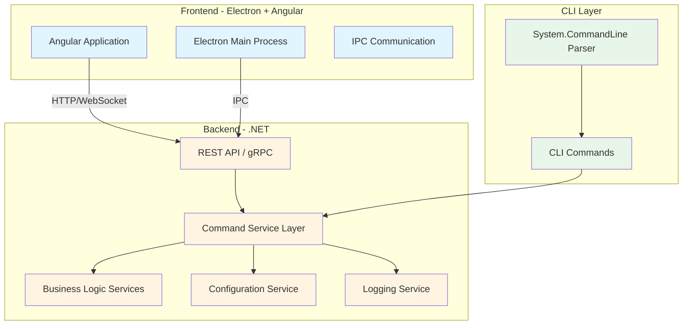

# Plano de Refatoração para Interface GUI (Electron + Angular)

## Visão Geral

Este documento descreve o plano de refatoração do DevMaid para incluir uma interface gráfica (GUI) moderna construída com Electron e Angular, mantendo a funcionalidade CLI existente.

## 1. Stack Tecnológica

### Tecnologias Principais

#### Frontend
- **Angular v21**: Framework principal para construção da interface gráfica
- **Angular Material v21**: Biblioteca de componentes UI para design moderno e responsivo
- **RxJS**: Streams reativos para gerenciamento de estado e operações assíncronas

#### Desktop Framework
- **Electron 41.0.3**: Framework para empacotamento da aplicação como desktop app
- **Electron Builder**: Ferramenta para criação de instaladores e builds multi-plataforma

#### Backend
- **ASP.NET Core**: API REST para comunicação com o frontend
- **SignalR**: Comunicação em tempo real para atualizações de progresso e eventos

#### Comunicação
- **HTTP (REST)**: Comunicação principal entre frontend e backend para a maioria das operações
- **SignalR**: Comunicação em tempo real para atualizações de progresso, notificações e eventos em tempo real

#### CLI Integration
- **Opção `--web`**: Nova flag no CLI que iniciará a aplicação no navegador ao invés do Electron
- **Modo Desktop**: Executa aplicação Electron com backend integrado
- **Modo Web**: Executa apenas o Angular no navegador com backend separado

### Arquitetura de Comunicação

```
┌─────────────────────────────────────────────────────────┐
│                     Frontend Layer                        │
├─────────────────────────────────────────────────────────┤
│  Angular Application (v21)                               │
│  ├─ HTTP Client (REST API)                               │
│  └─ SignalR Client (Real-time updates)                   │
└─────────────────────────────────────────────────────────┘
                           │
                           ├─────────────┬─────────────┐
                           │             │             │
                           ▼             ▼             ▼
                    ┌──────────┐  ┌──────────┐  ┌──────────┐
                    │  HTTP    │  │  SignalR │  │   IPC    │
                    │ Requests │  │ Events  │  │ (Electron)│
                    └──────────┘  └──────────┘  └──────────┘
                           │             │             │
                           └─────────────┴─────────────┘
                                         │
                           ┌─────────────▼─────────────┐
                           │     Backend Layer          │
                           ├─────────────────────────────┤
                           │  ASP.NET Core API           │
                           │  ├─ REST Controllers        │
                           │  ├─ SignalR Hubs            │
                           │  └─ Business Logic Services │
                           └─────────────────────────────┘
```

### Modos de Execução

#### Modo Desktop (Padrão)
```bash
devmaid gui
```
- Inicia Electron com Angular integrado
- Backend .NET roda em background
- Interface desktop nativa
- Acesso completo ao sistema de arquivos

#### Modo Web
```bash
devmaid gui --web
```
- Abre aplicação Angular no navegador padrão
- Backend .NET roda como servidor separado
- Acessível via navegador em localhost
- Ideal para desenvolvimento e testes

## 2. Análise da Arquitetura Atual

### 1.1 Estrutura Atual
```
DevMaid/
├── Program.cs                 # Entry point CLI
├── Commands/                  # Implementações de comandos
├── CommandOptions/            # DTOs para opções de comando
├── Services/                  # Serviços de negócio
├── Tui/                       # Interface Terminal (Terminal.Gui)
└── Utils.cs                   # Funções auxiliares
```

### 1.2 Problemas Atuais
- **Acoplamento forte**: A lógica de negócio está diretamente acoplada ao System.CommandLine
- **Sem camada de API**: Não existe uma API REST ou gRPC para comunicação externa
- **Logger acoplado ao console**: O logger escreve diretamente no console
- **Execução síncrona**: Processos são executados de forma síncrona

### 1.3 Pontos Fortes
- Separação clara entre Commands e Services
- Uso de DTOs para opções de comando
- Configuração centralizada via ConfigurationService
- Boa estrutura de testes

## 2. Arquitetura Proposta

### 2.1 Diagrama de Arquitetura



### 2.2 Nova Estrutura de Projetos

```
DevMaid/
├── DevMaid.Core/                    # Core Business Logic
│   ├── Services/
│   ├── Models/
│   ├── Interfaces/
│   └── DevMaid.Core.csproj
│
├── DevMaid.CLI/                     # CLI Application
│   ├── Program.cs
│   ├── Commands/
│   ├── CommandOptions/
│   └── DevMaid.CLI.csproj
│
├── DevMaid.Api/                     # REST API / gRPC Service
│   ├── Controllers/
│   ├── Services/
│   ├── Middleware/
│   ├── DevMaid.Api.csproj
│   └── appsettings.json
│
├── DevMaid.Gui/                     # Electron + Angular Application
│   ├── angular-app/                 # Angular frontend
│   │   ├── src/
│   │   │   ├── app/
│   │   │   │   ├── components/
│   │   │   │   ├── services/
│   │   │   │   ├── models/
│   │   │   │   └── modules/
│   │   │   ├── assets/
│   │   │   └── environments/
│   │   ├── angular.json
│   │   ├── package.json
│   │   └── tsconfig.json
│   ├── electron/                    # Electron main process
│   │   ├── main.ts
│   │   ├── preload.ts
│   │   └── package.json
│   ├── package.json
│   └── README.md
│
├── DevMaid.Tests/                   # Testes
│   ├── Core.Tests/
│   ├── CLI.Tests/
│   ├── API.Tests/
│   └── DevMaid.Tests.csproj
│
├── docs/                            # Documentação
│   └── ...
└── DevMaid.slnx                     # Solution file
```

## 3. Estratégia de Refatoração

### 3.1 Fase 1: Extração da Camada Core (MVP)

**Objetivo**: Separar a lógica de negócio da CLI

**Tarefas**:
1. Criar projeto `DevMaid.Core`
2. Extrair Services do projeto atual para `DevMaid.Core`
3. Criar interfaces para todos os serviços
4. Implementar serviço de logging abstrato (ILogger já existe)
5. Mover DTOs para `DevMaid.Core.Models`
6. Criar modelos de resposta padronizados

**Novos Serviços Core**:
```csharp
// DevMaid.Core/Services/IDatabaseService.cs
public interface IDatabaseService
{
    Task<DatabaseBackupResult> BackupAsync(DatabaseBackupOptions options, IProgress<OperationProgress>? progress = null);
    Task<DatabaseRestoreResult> RestoreAsync(DatabaseRestoreOptions options, IProgress<OperationProgress>? progress = null);
    Task<List<string>> ListDatabasesAsync(DatabaseConnectionOptions options);
}

// DevMaid.Core/Services/IFileService.cs
public interface IFileService
{
    Task<FileCombineResult> CombineFilesAsync(FileCombineOptions options, IProgress<OperationProgress>? progress = null);
}

// DevMaid.Core/Services/IWingetService.cs
public interface IWingetService
{
    Task<WingetBackupResult> BackupPackagesAsync(WingetBackupOptions options, IProgress<OperationProgress>? progress = null);
    Task<WingetRestoreResult> RestorePackagesAsync(WingetRestoreOptions options, IProgress<OperationProgress>? progress = null);
}
```

**Modelos de Resposta**:
```csharp
// DevMaid.Core/Models/OperationResult.cs
public record OperationResult
{
    public bool Success { get; init; }
    public string? Message { get; init; }
    public string? ErrorMessage { get; init; }
    public Exception? Exception { get; init; }
    public TimeSpan Duration { get; init; }
}

public record OperationProgress
{
    public int CurrentStep { get; init; }
    public int TotalSteps { get; init; }
    public string? CurrentOperation { get; init; }
    public double Percentage { get; init; }
}
```

### 3.2 Fase 2: Refatoração da CLI

**Objetivo**: Adaptar a CLI para usar a camada Core

**Tarefas**:
1. Criar projeto `DevMaid.CLI`
2. Mover Commands e CommandOptions para `DevMaid.CLI`
3. Adaptar Commands para usar serviços do Core
4. Manter compatibilidade com comandos existentes
5. Adicionar suporte a progresso visual na CLI

**Exemplo de adaptação**:
```csharp
// DevMaid.CLI/Commands/DatabaseCommand.cs
public static class DatabaseCommand
{
    public static Command Build()
    {
        var command = new Command("database", "Database utilities.");
        var databaseService = new DatabaseService(ConfigurationService.GetDatabaseConfig(), Logger.Instance);
        
        command.AddCommand(BuildBackupCommand(databaseService));
        command.AddCommand(BuildRestoreCommand(databaseService));
        
        return command;
    }
    
    private static Command BuildBackupCommand(IDatabaseService databaseService)
    {
        var backupCommand = new Command("backup", "Create a backup of a PostgreSQL database.");
        
        // ... options setup ...
        
        backupCommand.SetAction(async parseResult =>
        {
            var options = ParseOptions(parseResult);
            var progress = new ConsoleProgressReporter();
            
            try
            {
                var result = await databaseService.BackupAsync(options, progress);
                
                if (result.Success)
                {
                    Logger.LogInformation($"Backup completed successfully in {result.Duration.TotalSeconds:F2}s");
                }
                else
                {
                    Logger.LogError($"Backup failed: {result.ErrorMessage}");
                }
            }
            catch (Exception ex)
            {
                Logger.LogError($"Error: {ex.Message}");
            }
        });
        
        return backupCommand;
    }
}
```

### 3.3 Fase 3: Criação da API Backend

**Objetivo**: Criar API REST para comunicação com a GUI

**Tarefas**:
1. Criar projeto `DevMaid.Api` (ASP.NET Core Web API)
2. Implementar controllers para cada serviço
3. Adicionar suporte a SignalR para atualizações em tempo real
4. Implementar autenticação/autorização (se necessário)
5. Adicionar CORS para comunicação com Electron
6. Criar OpenAPI/Swagger documentation

**Exemplo de Controller**:
```csharp
// DevMaid.Api/Controllers/DatabaseController.cs
[ApiController]
[Route("api/[controller]")]
public class DatabaseController : ControllerBase
{
    private readonly IDatabaseService _databaseService;
    private readonly IHubContext<OperationHub> _hubContext;
    
    public DatabaseController(IDatabaseService databaseService, IHubContext<OperationHub> hubContext)
    {
        _databaseService = databaseService;
        _hubContext = hubContext;
    }
    
    [HttpPost("backup")]
    public async Task<ActionResult<DatabaseBackupResult>> Backup([FromBody] DatabaseBackupOptions options)
    {
        var progress = new SignalRProgressReporter(_hubContext, Context.ConnectionId);
        var result = await _databaseService.BackupAsync(options, progress);
        
        if (result.Success)
            return Ok(result);
        else
            return BadRequest(result);
    }
    
    [HttpPost("restore")]
    public async Task<ActionResult<DatabaseRestoreResult>> Restore([FromBody] DatabaseRestoreOptions options)
    {
        var progress = new SignalRProgressReporter(_hubContext, Context.ConnectionId);
        var result = await _databaseService.RestoreAsync(options, progress);
        
        if (result.Success)
            return Ok(result);
        else
            return BadRequest(result);
    }
    
    [HttpGet("databases")]
    public async Task<ActionResult<List<string>>> ListDatabases([FromQuery] DatabaseConnectionOptions options)
    {
        var databases = await _databaseService.ListDatabasesAsync(options);
        return Ok(databases);
    }
}
```

**SignalR Hub para progresso**:
```csharp
// DevMaid.Api/Hubs/OperationHub.cs
public class OperationHub : Hub
{
    public async Task JoinOperationGroup(string operationId)
    {
        await Groups.AddToGroupAsync(Context.ConnectionId, operationId);
    }
    
    public async Task LeaveOperationGroup(string operationId)
    {
        await Groups.RemoveFromGroupAsync(Context.ConnectionId, operationId);
    }
}
```

### 3.4 Fase 4: Desenvolvimento do Frontend Angular

**Objetivo**: Criar interface moderna e responsiva

**Tecnologias**:
- Angular v21
- Angular Material v21
- RxJS para streams reativos
- HttpClient para comunicação com API
- SignalR Client para atualizações em tempo real

**Estrutura do Angular**:
```
angular-app/src/app/
├── core/
│   ├── services/
│   │   ├── api.service.ts
│   │   ├── signalr.service.ts
│   │   └── configuration.service.ts
│   └── models/
│
├── shared/
│   ├── components/
│   │   ├── progress-dialog/
│   │   ├── error-dialog/
│   │   └── confirmation-dialog/
│   └── pipes/
│
├── features/
│   ├── database/
│   │   ├── components/
│   │   │   ├── database-backup.component.ts
│   │   │   ├── database-restore.component.ts
│   │   │   └── database-list.component.ts
│   │   ├── services/
│   │   └── models/
│   ├── files/
│   │   ├── components/
│   │   │   └── file-combine.component.ts
│   │   └── services/
│   ├── winget/
│   │   ├── components/
│   │   │   ├── winget-backup.component.ts
│   │   │   └── winget-restore.component.ts
│   │   └── services/
│   └── claude/
│       ├── components/
│       └── services/
│
├── layout/
│   ├── components/
│   │   ├── sidebar/
│   │   ├── header/
│   │   └── main-content/
│   └── services/
│
└── app-routing.module.ts
```

**Exemplo de Serviço Angular**:
```typescript
// angular-app/src/app/features/database/services/database.service.ts
@Injectable({ providedIn: 'root' })
export class DatabaseService {
  private readonly apiUrl = 'api/database';
  
  constructor(
    private http: HttpClient,
    private signalRService: SignalRService
  ) {}
  
  backup(options: DatabaseBackupOptions): Observable<DatabaseBackupResult> {
    return this.http.post<DatabaseBackupResult>(
      `${this.apiUrl}/backup`,
      options
    );
  }
  
  backupWithProgress(options: DatabaseBackupOptions): Observable<OperationProgress> {
    return this.signalRService.subscribeToProgress();
  }
  
  restore(options: DatabaseRestoreOptions): Observable<DatabaseRestoreResult> {
    return this.http.post<DatabaseRestoreResult>(
      `${this.apiUrl}/restore`,
      options
    );
  }
  
  listDatabases(connection: DatabaseConnectionOptions): Observable<string[]> {
    return this.http.get<string[]>(`${this.apiUrl}/databases`, {
      params: this.httpParamsFrom(connection)
    });
  }
}
```

**Exemplo de Componente**:
```typescript
// angular-app/src/app/features/database/components/database-backup.component.ts
@Component({
  selector: 'dm-database-backup',
  templateUrl: './database-backup.component.html',
  styleUrls: ['./database-backup.component.scss']
})
export class DatabaseBackupComponent implements OnInit {
  form = this.fb.group({
    databaseName: ['', Validators.required],
    host: ['localhost'],
    port: ['5432'],
    username: [''],
    password: [''],
    outputPath: [''],
    backupAll: [false],
    excludeTableData: this.fb.array([])
  });
  
  isBackingUp = false;
  progress: OperationProgress | null = null;
  
  constructor(
    private fb: FormBuilder,
    private databaseService: DatabaseService,
    private snackBar: MatSnackBar
  ) {}
  
  ngOnInit(): void {
    this.loadSavedConfiguration();
  }
  
  async onBackup(): Promise<void> {
    if (this.form.invalid) return;
    
    this.isBackingUp = true;
    const options = this.form.value;
    
    try {
      // Subscribe to progress updates
      const progress$ = this.databaseService.backupWithProgress(options);
      progress$.subscribe(progress => {
        this.progress = progress;
      });
      
      // Execute backup
      const result = await firstValueFrom(this.databaseService.backup(options));
      
      if (result.success) {
        this.snackBar.open('Backup completed successfully!', 'Close', {
          duration: 3000
        });
      } else {
        this.snackBar.open(`Backup failed: ${result.errorMessage}`, 'Close', {
          duration: 5000
        });
      }
    } catch (error) {
      this.snackBar.open('An error occurred during backup', 'Close', {
        duration: 5000
      });
    } finally {
      this.isBackingUp = false;
      this.progress = null;
    }
  }
}
```

### 3.5 Fase 5: Integração Electron

**Objetivo**: Empacotar aplicação como desktop app

**Tarefas**:
1. Configurar Electron main process
2. Implementar preload script para IPC
3. Configurar auto-updater
4. Criar installer (NSIS ou squirrel)
5. Configurar build para múltiplas plataformas

**Exemplo de Main Process**:
```typescript
// electron/main.ts
import { app, BrowserWindow, ipcMain } from 'electron';
import * as path from 'path';

let mainWindow: BrowserWindow;

function createWindow(): void {
  mainWindow = new BrowserWindow({
    width: 1200,
    height: 800,
    webPreferences: {
      preload: path.join(__dirname, 'preload.js'),
      nodeIntegration: false,
      contextIsolation: true
    },
    icon: path.join(__dirname, '../assets/icon.png')
  });

  // Load Angular app
  if (process.env.NODE_ENV === 'development') {
    mainWindow.loadURL('http://localhost:4200');
    mainWindow.webContents.openDevTools();
  } else {
    mainWindow.loadFile(path.join(__dirname, '../angular-app/index.html'));
  }
}

app.whenReady().then(() => {
  createWindow();
  
  app.on('activate', () => {
    if (BrowserWindow.getAllWindows().length === 0) {
      createWindow();
    }
  });
});

app.on('window-all-closed', () => {
  if (process.platform !== 'darwin') {
    app.quit();
  }
});

// IPC handlers
ipcMain.handle('get-app-version', () => {
  return app.getVersion();
});

ipcMain.handle('minimize-window', () => {
  mainWindow.minimize();
});

ipcMain.handle('maximize-window', () => {
  if (mainWindow.isMaximized()) {
    mainWindow.unmaximize();
  } else {
    mainWindow.maximize();
  }
});

ipcMain.handle('close-window', () => {
  mainWindow.close();
});
```

**Exemplo de Preload Script**:
```typescript
// electron/preload.ts
import { contextBridge, ipcRenderer } from 'electron';

contextBridge.exposeInMainWorld('electronAPI', {
  getAppVersion: () => ipcRenderer.invoke('get-app-version'),
  minimizeWindow: () => ipcRenderer.invoke('minimize-window'),
  maximizeWindow: () => ipcRenderer.invoke('maximize-window'),
  closeWindow: () => ipcRenderer.invoke('close-window'),
  on: (channel: string, callback: (...args: any[]) => void) => {
    ipcRenderer.on(channel, (event, ...args) => callback(...args));
  }
});
```

**Configuração de Build**:
```json
{
  "name": "devmaid-gui",
  "version": "1.0.0",
  "main": "dist/electron/main.js",
  "scripts": {
    "build:angular": "cd angular-app && ng build --configuration production",
    "build:electron": "tsc electron/main.ts electron/preload.ts",
    "build": "npm run build:angular && npm run build:electron",
    "electron": "electron .",
    "electron:dev": "concurrently \"npm run build:angular -- --watch\" \"wait-on http://localhost:4200 && electron .\"",
    "pack": "electron-builder --dir",
    "dist": "electron-builder"
  },
  "build": {
    "appId": "com.devmaid.gui",
    "productName": "DevMaid",
    "directories": {
      "output": "dist/electron-builder"
    },
    "files": [
      "dist/electron/**/*",
      "angular-app/dist/**/*",
      "assets/**/*"
    ],
    "win": {
      "target": ["nsis"],
      "icon": "assets/icon.ico"
    },
    "mac": {
      "target": ["dmg"],
      "icon": "assets/icon.icns"
    },
    "linux": {
      "target": ["AppImage", "deb"],
      "icon": "assets/icon.png"
    }
  },
  "devDependencies": {
    "@types/node": "^20.0.0",
    "electron": "^41.0.3",
    "electron-builder": "^24.0.0",
    "typescript": "^5.0.0"
  }
}
```

### 3.6 Fase 6: Modo Híbrido (CLI + GUI)

**Objetivo**: Permitir que o usuário escolha entre CLI e GUI

**Tarefas**:
1. Modificar `Program.cs` para detectar se deve iniciar GUI
2. Adicionar comando `devmaid gui` para iniciar interface gráfica desktop (Electron)
3. Adicionar opção `--web` para iniciar interface no navegador (modo web)
4. Configurar API para rodar em background quando GUI está ativa
5. Implementar single instance para evitar múltiplas instâncias

**Exemplo de Program.cs atualizado**:
```csharp
// Program.cs
internal static class Program
{
    private static int Main(string[] args)
    {
        // Check if GUI mode is requested
        if (args.Length > 0 && args[0].Equals("gui", StringComparison.OrdinalIgnoreCase))
        {
            return RunGuiMode(args.Skip(1).ToArray());
        }
        
        // CLI mode
        return RunCliMode(args);
    }
    
    private static int RunGuiMode(string[] args)
    {
        // Check if web mode is requested
        bool useWebMode = args.Contains("--web");
        
        // Start API server in background
        var apiTask = Task.Run(() => DevMaid.Api.Program.Main(args));
        
        if (useWebMode)
        {
            // Launch in default browser
            var browserUrl = "http://localhost:5000";
            Process.Start(new ProcessStartInfo
            {
                FileName = browserUrl,
                UseShellExecute = true
            });
            
            Console.WriteLine($"DevMaid GUI running in web mode at {browserUrl}");
            Console.WriteLine("Press Ctrl+C to stop...");
        }
        else
        {
            // Launch Electron GUI
            var electronPath = Path.Combine(AppContext.BaseDirectory, "DevMaid.Gui.exe");
            var process = Process.Start(electronPath);
        }
        
        // Wait for API to complete (usually never)
        apiTask.Wait();
        
        return 0;
    }
    
    private static int RunCliMode(string[] args)
    {
        // Existing CLI logic
        Logger.SetLogger(new ConsoleLogger(useColors: true));
        
        var rootCommand = new RootCommand("DevMaid command line tools")
        {
            TableParserCommand.Build(),
            FileCommand.Build(),
            // ... other commands ...
            new Command("gui", "Launch graphical user interface")
            {
                new Option<bool>("--web", "Run in web browser instead of Electron")
            }
        };
        
        return rootCommand.Parse(args).Invoke();
    }
}
```

## 4. Considerações Técnicas

### 4.1 Comunicação entre Frontend e Backend

**Opção 1: REST API + SignalR (Recomendado)**
- Vantagens: Fácil de implementar, bom suporte no Angular
- Desvantagens: Requer servidor HTTP

**Opção 2: gRPC**
- Vantagens: Mais eficiente, type-safe
- Desvantagens: Mais complexo, requer gRPC-Web para browser

**Opção 3: IPC Nativo do Electron**
- Vantagens: Comunicação direta, sem servidor HTTP
- Desvantagens: Requer wrapper .NET para IPC, mais complexo

**Recomendação**: Usar REST API + SignalR inicialmente, considerar gRPC para otimizações futuras.

### 4.2 Gerenciamento deProcessos

**Desafio**: Executar processos longos (pg_dump, winget) com feedback em tempo real

**Solução**:
```csharp
// DevMaid.Core/Services/ProcessExecutor.cs
public class ProcessExecutor : IProcessExecutor
{
    public async Task<ProcessExecutionResult> ExecuteAsync(
        ProcessExecutionOptions options,
        IProgress<OperationProgress>? progress = null,
        CancellationToken cancellationToken = default)
    {
        var startInfo = new ProcessStartInfo
        {
            FileName = options.FileName,
            Arguments = options.Arguments,
            RedirectStandardOutput = true,
            RedirectStandardError = true,
            UseShellExecute = false,
            CreateNoWindow = true
        };
        
        if (options.EnvironmentVariables != null)
        {
            foreach (var kvp in options.EnvironmentVariables)
            {
                startInfo.Environment[kvp.Key] = kvp.Value;
            }
        }
        
        using var process = Process.Start(startInfo);
        if (process == null)
        {
            throw new ProcessExecutionException($"Failed to start process: {options.FileName}");
        }
        
        var outputBuilder = new StringBuilder();
        var errorBuilder = new StringBuilder();
        
        process.OutputDataReceived += (sender, e) =>
        {
            if (!string.IsNullOrEmpty(e.Data))
            {
                outputBuilder.AppendLine(e.Data);
                progress?.Report(new OperationProgress
                {
                    CurrentOperation = e.Data,
                    Percentage = CalculatePercentage(options, outputBuilder.Length)
                });
            }
        };
        
        process.ErrorDataReceived += (sender, e) =>
        {
            if (!string.IsNullOrEmpty(e.Data))
            {
                errorBuilder.AppendLine(e.Data);
            }
        };
        
        process.BeginOutputReadLine();
        process.BeginErrorReadLine();
        
        await process.WaitForExitAsync(cancellationToken);
        
        return new ProcessExecutionResult
        {
            ExitCode = process.ExitCode,
            StandardOutput = outputBuilder.ToString(),
            StandardError = errorBuilder.ToString(),
            Success = process.ExitCode == 0
        };
    }
}
```

### 4.3 Gerenciamento de Configuração

**Desafio**: Compartilhar configuração entre CLI e GUI

**Solução**:
- Manter configuração em arquivo JSON (appsettings.json)
- Usar mesma localização para CLI e GUI
- API deve expor endpoints para gerenciar configuração
- GUI deve ter tela de configurações

```csharp
// DevMaid.Api/Controllers/ConfigurationController.cs
[ApiController]
[Route("api/[controller]")]
public class ConfigurationController : ControllerBase
{
    [HttpGet]
    public ActionResult<DevMaidConfiguration> GetConfiguration()
    {
        var config = ConfigurationService.GetConfiguration();
        return Ok(config);
    }
    
    [HttpPost]
    public ActionResult UpdateConfiguration([FromBody] DevMaidConfiguration config)
    {
        ConfigurationService.UpdateConfiguration(config);
        return Ok();
    }
    
    [HttpGet("database")]
    public ActionResult<DatabaseConnectionConfig> GetDatabaseConfig()
    {
        var config = ConfigurationService.GetDatabaseConfig();
        return Ok(config);
    }
    
    [HttpPost("database")]
    public ActionResult UpdateDatabaseConfig([FromBody] DatabaseConnectionConfig config)
    {
        ConfigurationService.UpdateDatabaseConfig(config);
        return Ok();
    }
}
```

### 4.4 Segurança

**Considerações**:
1. **Sanitização de Input**: Validar todos os inputs antes de executar comandos
2. **Path Traversal**: Continuar usando SecurityUtils.IsValidPath()
3. **SQL Injection**: Usar parâmetros em todas as queries
4. **Autenticação**: Considerar adicionar autenticação básica ou token-based
5. **CORS**: Configurar CORS adequadamente
6. **Rate Limiting**: Implementar rate limiting na API

```csharp
// DevMaid.Api/Startup.cs
public void ConfigureServices(IServiceCollection services)
{
    services.AddControllers();
    
    // CORS configuration
    services.AddCors(options =>
    {
        options.AddPolicy("ElectronPolicy", builder =>
        {
            builder.WithOrigins("app://*")
                   .AllowAnyMethod()
                   .AllowAnyHeader();
        });
    });
    
    // Rate limiting
    services.AddRateLimiter(options =>
    {
        options.AddPolicy("DefaultPolicy", context =>
            RateLimitPartition.GetSlidingWindowLimiter(
                partitionKey: context.Connection.RemoteIpAddress?.ToString(),
                factory: _ => new SlidingWindowRateLimiterOptions
                {
                    PermitLimit = 100,
                    Window = TimeSpan.FromMinutes(1),
                    SegmentsPerWindow = 2
                }));
    });
    
    services.AddSignalR();
}
```

### 4.5 Testes

**Estratégia de Testes**:
1. **Unit Tests**: Testar lógica de negócio no Core
2. **Integration Tests**: Testar API endpoints
3. **E2E Tests**: Testar fluxos completos na GUI (Cypress/Playwright)

```csharp
// DevMaid.Tests/Core/DatabaseServiceTests.cs
public class DatabaseServiceTests
{
    [Fact]
    public async Task BackupAsync_WithValidOptions_ShouldSucceed()
    {
        // Arrange
        var mockExecutor = new Mock<IProcessExecutor>();
        mockExecutor.Setup(x => x.ExecuteAsync(It.IsAny<ProcessExecutionOptions>(), It.IsAny<IProgress<OperationProgress>>(), It.IsAny<CancellationToken>()))
                   .ReturnsAsync(new ProcessExecutionResult { Success = true, ExitCode = 0 });
        
        var service = new DatabaseService(
            mockExecutor.Object,
            new ConsoleLogger(),
            new DatabaseConnectionConfig { Host = "localhost", Port = "5432" });
        
        var options = new DatabaseBackupOptions
        {
            DatabaseName = "testdb",
            Host = "localhost",
            Port = "5432"
        };
        
        // Act
        var result = await service.BackupAsync(options);
        
        // Assert
        Assert.True(result.Success);
        mockExecutor.Verify(x => x.ExecuteAsync(It.IsAny<ProcessExecutionOptions>(), It.IsAny<IProgress<OperationProgress>>(), It.IsAny<CancellationToken>()), Times.Once);
    }
}
```

```typescript
// angular-app/e2e/database-backup.spec.ts
describe('Database Backup E2E', () => {
  beforeEach(() => {
    cy.visit('/database/backup');
  });
  
  it('should successfully backup a database', () => {
    cy.get('[formcontrolname="databaseName"]').type('testdb');
    cy.get('[formcontrolname="host"]').clear().type('localhost');
    cy.get('[formcontrolname="port"]').clear().type('5432');
    cy.get('[formcontrolname="username"]').type('postgres');
    
    cy.get('button[type="submit"]').click();
    
    cy.get('.progress-bar', { timeout: 30000 }).should('exist');
    cy.get('.snackbar-success', { timeout: 60000 }).should('contain', 'Backup completed successfully');
  });
  
  it('should show validation errors for invalid input', () => {
    cy.get('button[type="submit"]').click();
    
    cy.get('.error-message').should('contain', 'Database name is required');
  });
});
```

## 5. Cronograma Estimado

### Sprint 1: Core Layer (2 semanas)
- [ ] Criar projeto DevMaid.Core
- [ ] Extrair e refatorar Services existentes
- [ ] Criar interfaces para todos os serviços
- [ ] Implementar modelos de resposta padronizados
- [ ] Escrever unit tests para Core

### Sprint 2: CLI Refactoring (1 semana)
- [ ] Criar projeto DevMaid.CLI
- [ ] Adaptar Commands para usar Core
- [ ] Testar compatibilidade com comandos existentes
- [ ] Adicionar suporte a progresso visual

### Sprint 3: API Development (2 semanas)
- [ ] Criar projeto DevMaid.Api
- [ ] Implementar controllers e endpoints
- [ ] Configurar SignalR para progresso em tempo real
- [ ] Adicionar autenticação/autorização
- [ ] Configurar CORS e segurança
- [ ] Escrever integration tests

### Sprint 4: Angular Frontend (3 semanas)
- [ ] Configurar projeto Angular
- [ ] Implementar layout e navegação
- [ ] Criar componentes Database
- [ ] Criar componentes File
- [ ] Criar componentes Winget
- [ ] Criar componentes Claude/OpenCode
- [ ] Implementar services de API
- [ ] Adicionar tratamento de erros

### Sprint 5: Electron Integration (1 semana)
- [ ] Configurar Electron
- [ ] Implementar IPC handlers
- [ ] Integrar com Angular
- [ ] Configurar build e packaging

### Sprint 6: Testing & Polish (2 semanas)
- [ ] Escrever E2E tests
- [ ] Testar fluxos completos
- [ ] Corrigir bugs
- [ ] Otimizar performance
- [ ] Melhorar UX
- [ ] Criar documentação

**Total Estimado: 11 semanas**

## 6. Riscos e Mitigações

### Risco 1: Complexidade do Projeto
- **Descrição**: Projeto pode se tornar muito complexo com múltiplas camadas
- **Mitigação**: Começar com MVP, iterar gradualmente, manter código limpo e bem documentado

### Risco 2: Performance da API
- **Descrição**: Processos longos podem bloquear a API
- **Mitigação**: Usar async/await em toda parte, implementar filas para operações longas

### Risco 3: Compatibilidade entre CLI e GUI
- **Descrição**: Mudanças no Core podem quebrar CLI ou GUI
- **Mitigação**: Testes abrangentes, versionamento de API, contratos claros

### Risco 4: Segurança
- **Descrição**: Expor API pode criar vulnerabilidades
- **Mitigação**: Validação rigorosa, autenticação, rate limiting, auditoria de segurança

### Risco 5: Manutenção de Múltiplos Projetos
- **Descrição**: Manter CLI, API e GUI pode ser trabalhoso
- **Mitigação**: Automatizar builds e testes, usar CI/CD, manter documentação atualizada

## 7. Próximos Passos

1. **Revisão e Aprovação**: Discutir este plano com stakeholders
2. **Setup Inicial**: Criar estrutura de projetos e solution
3. **Protótipo**: Criar protótipo de uma funcionalidade simples (ex: backup de database)
4. **Validação**: Testar protótipo e obter feedback
5. **Implementação Completa**: Seguir cronograma proposto

## 8. Recursos Necessários

### Desenvolvimento
- Visual Studio 2022 ou VS Code
- .NET 10 SDK
- Node.js 20+
- Angular CLI 21+
- Electron 41.0.3

### Ferramentas
- Git
- Postman (para testar API)
- Docker (opcional, para testes)

### Bibliotecas Principais
- .NET: ASP.NET Core, SignalR, Npgsql
- Angular: Angular Material v21, RxJS
- Electron: electron 41.0.3, electron-builder

## 9. Conclusão

Este plano de refatoração fornece uma abordagem estruturada para adicionar uma interface GUI moderna ao DevMaid, mantendo a funcionalidade CLI existente. A arquitetura proposta separa claramente as responsabilidades, facilita a manutenção e permite evolução futura.

A implementação deve ser feita de forma iterativa, começando pela extração da camada Core e progredindo gradualmente para a GUI completa. Isso permite validação contínua e ajustes conforme necessário.

---

**Data**: 16 de Março de 2026  
**Autor**: Filiphe Vilar Figueiredo  
**Versão**: 1.0